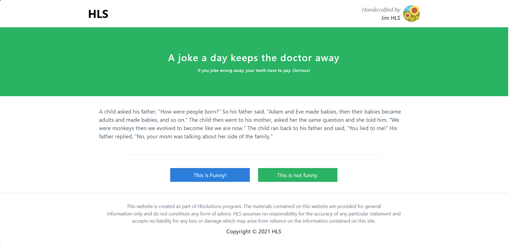

# Jokee Single Serving Website

This is a web developer intern assignment at HLS



Link demo: https://zens-intern-assignment.vercel.app/

\*\*\* Note: Because of limited time and knowledge about PHP, I decided to use [Mock API](https://mockapi.io/projects) instead of PHP Laravel

# How to run this project locally

- Required: Node (20.11.1), npm (10.2.4)
- Clone this repo to your device and run:
  ```bash
    npm i
  ```
- Config your `.env`

  ```env
    VITE_MOCK_API=Your MOCK API root
  ```

- Run project in dev mode:
  ```bash
    npm run dev
  ```

# Author

- [toanle312](https://github.com/toanle312)
